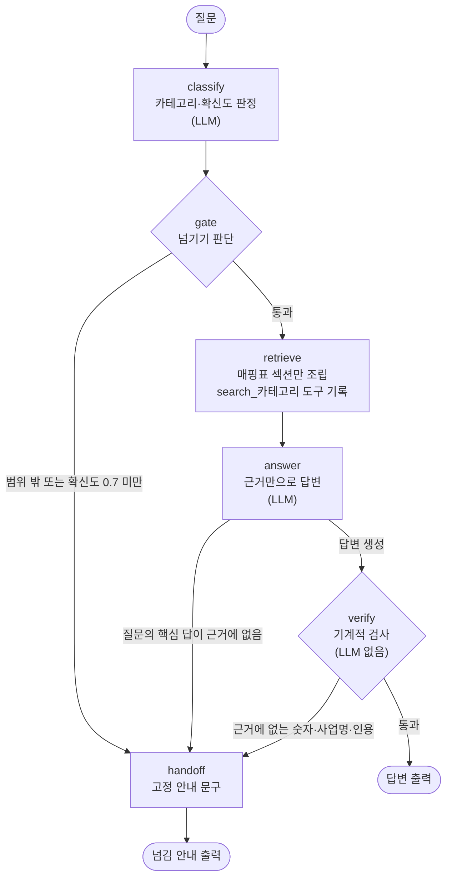
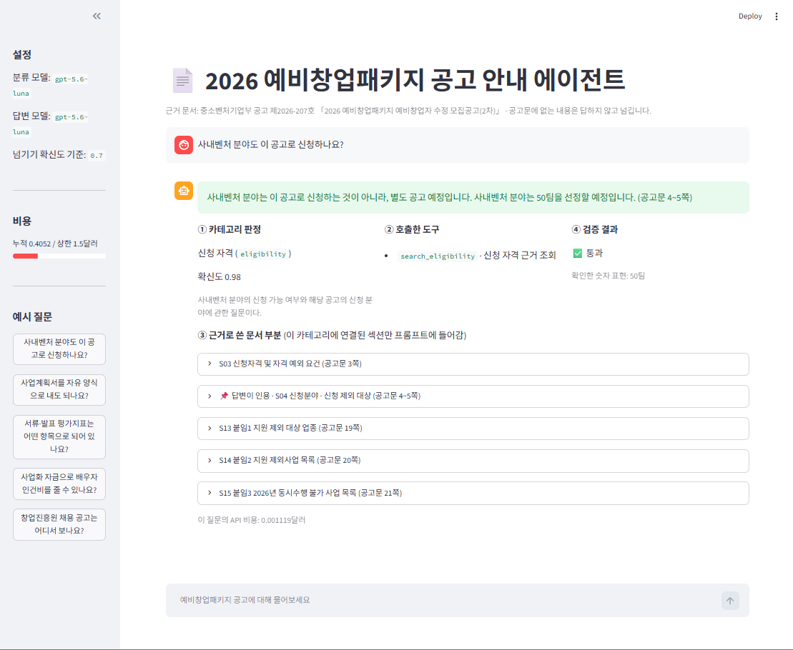
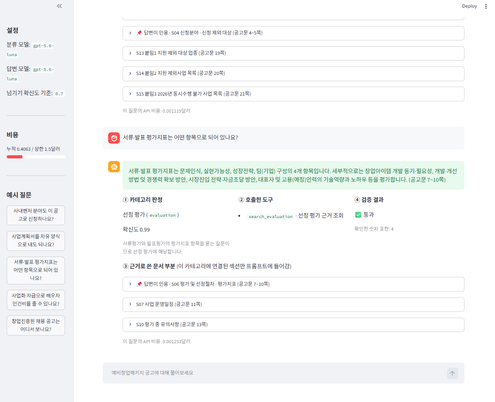
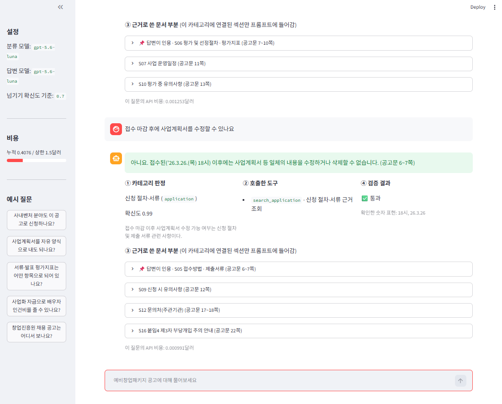

# REPORT — 예비창업패키지 공고 안내 라우팅 에이전트

## 1. 주제와 근거 문서

### 무엇을 골랐나
**「2026 예비창업패키지 예비창업자 수정 모집공고(2차)」 안내 에이전트**입니다. 근거 문서는 중소벤처기업부 공고 제2026-207호(2026-03-24, PDF 22쪽) **한 건**입니다.

### 왜 골랐나
- 1인 창업에 관심이 있고, 이전 과제(창업 지원 뉴스 브리핑 에이전트)와 주제가 이어집니다.
- 예비창업자는 22쪽짜리 공고문에서 자격·절차·평가·지원 내용을 직접 찾아야 합니다. 비슷한 사업(초기창업패키지 등)이 많아, **공고문을 읽지 않고 그럴듯하게 답하기 쉬운** 주제입니다.

### 주제 조건 확인 (공고문 원본을 읽고 확인)

| 조건 | 확인 결과 |
|---|---|
| 카테고리 3~5개, 카테고리마다 답이 다름 | 공고문 3장(자격)·4장(접수)·5장(평가)·1·2장(지원)이 서로 다른 내용을 담음 |
| 근거 문서가 나눠 넣을 만큼 김 | 22쪽, 18,624자. 가장 짧은 카테고리도 4,484자 |
| 근거 없이도 그럴듯하게 답할 수 있는 질문 | 2단계 추가 지원 **금액**은 공고문에 없음(비율 "50% 내외"만 있음). 다음 연도 모집 일정, 다른 사업의 지원금도 없음 |

### 근거 문서를 공고문 한 건으로 한정한 이유
같은 공고 페이지에 **[별첨 4] 주요 질의응답**(20쪽)이 있었지만 넣지 않았습니다.
- **두 문서의 표기가 다릅니다.** 1단계 금액이 공고문은 "20백만원", 질의응답은 "20백만원 내외"입니다. 질의응답은 창업 의무 조항을 "공고문 16페이지"라고 안내하지만, 수정본 공고문에서는 15쪽에 있습니다. 두 문서를 함께 넣으면 필수 사실을 어느 쪽 기준으로 쓸지 문항마다 판단해야 합니다.
- **텍스트 추출이 깨졌습니다.** 질의응답 PDF를 추출하면 줄이 중복되고 "20"과 "백만원"이 떨어졌습니다. 근거 텍스트가 오염되면 검증기와 채점기가 모두 틀린 숫자를 정답으로 받아들일 수 있습니다.

- 버전 고정: 공고번호·수정일을 `docs/SOURCE.md`와 `goldenset.json`에 기록했습니다.
- 이용 조건: 게시 페이지 표기에 따라 공공누리 제1유형(출처표시)입니다.

---

## 2. 카테고리 설계

### 카테고리 목록과 나눈 근거
**기준은 신청자가 거치는 단계**입니다(신청 전 확인 → 신청 → 평가 → 선정 후). 공고문의 장 구성과 거의 그대로 대응합니다.

| 카테고리 | 답하는 내용 | 조회 도구 |
|---|---|---|
| `eligibility` 신청 자격 | 누가 신청할 수 있나, 기준일, 자격 예외, 신청분야, 제외 대상 | `search_eligibility` |
| `application` 신청 절차·서류 | 접수 기간·방법, 실명인증, 주관기관 선택, 제출서류, 문의처 | `search_application` |
| `evaluation` 선정 평가 | 평가 단계·일정, 가점·면제·우선선정, 평가지표, 이의신청 | `search_evaluation` |
| `support` 지원 내용·선정 후 의무 | 사업화 자금, 단계별 지원, 집행 비목, 협약기간, 선정 후 의무·제재 | `search_support` |
| `out_of_scope` 범위 밖 | 이 공고와 관계없는 질문 (다른 사업, 다른 연도, 세무·대출, 잡담) | 없음 → 넘기기 |

- 원래 네 번째 카테고리는 "지원 내용"이었습니다. 공고문 6장 유의사항(11~16쪽)의 절반 이상이 **선정 후 의무와 제재**라서 들어갈 자리가 필요해 "지원 내용·선정 후 의무"로 넓혔습니다.
- 본 카테고리 4개와 범위 밖 1개로 합계 5개입니다. "3~5개"를 범위 밖 포함/미포함 어느 쪽으로 읽어도 맞습니다.

### 매핑표 (카테고리 ↔ 공고문 부분)
수업 예제에서 라우트마다 필요한 장만 골라 근거를 만든 것처럼, 문서 전체가 아니라 카테고리에 필요한 부분만 넣기 위해 공고문을 **쪽이 아니라 장·항목 제목 단위로** 16개 섹션으로 나눴습니다. 7쪽·11쪽·13쪽은 한 쪽 안에 두 카테고리의 내용이 함께 있어, 쪽 단위로 자르면 "카테고리마다 다른 근거만 넣기"를 지킬 수 없었기 때문입니다. 이 표는 `context.py`의 `SECTIONS`에 그대로 들어 있고, 근거 조립에 그대로 쓰입니다.

| 섹션 | 제목 | 쪽 | 카테고리 |
|---|---|---|---|
| S01 | 사업개요 | 1 | support |
| S02 | 세부 지원내용 | 2 | support |
| S03 | 신청자격 및 자격 예외 요건 | 3 | eligibility |
| S04 | 신청분야 · 신청 제외 대상 | 4~5 | eligibility |
| S05 | 접수방법 · 제출서류 | 6~7 | application |
| S06 | 평가 및 선정절차 · 평가지표 | 7~10 | evaluation |
| S07 | 사업 운영일정 | 11 | evaluation |
| S08 | 유의사항(부정수급 제재 등) | 11 | support |
| S09 | 신청 시 유의사항 | 12 | application |
| S10 | 평가 중 유의사항 | 13 | evaluation |
| S11 | 선정 후 유의사항 · 선정자의 의무 및 책임 | 13~16 | support |
| S12 | 문의처(주관기관) | 17~18 | application |
| S13 | 붙임1 지원 제외 대상 업종 | 19 | eligibility |
| S14 | 붙임2 지원 제외사업 목록 | 20 | eligibility |
| S15 | 붙임3 2026년 동시수행 불가 사업 목록 | 21 | eligibility |
| S16 | 붙임4 제3자 부당개입 주의 안내 | 22 | application |

카테고리별 조립 결과: 자격 4,704자 · 신청 4,484자 · 평가 4,507자 · 지원 5,275자 · 범위 밖 0자

**매핑 점검 (스크립트)**
- 22쪽 전체가 한 섹션 이상에 배정됨
- 평가셋의 필수 사실 구절 33개가 모두 **자기 카테고리 섹션, 적어 둔 쪽 안에** 있음 (33/33)
- **카테고리마다 서로 다른 근거만 들어감**: 섹션 16개가 각각 카테고리 **1개에만** 속하고(중복 0), 한 번에 프롬프트에 들어가는 근거는 문서 전체의 **24~28%**입니다(자격 25% · 신청 24% · 평가 24% · 지원 28% · 범위 밖 0%). 예로 평가 카테고리의 답변 프롬프트를 만들어 보면 다른 카테고리 섹션 ID가 **0개** 들어 있습니다.
- 첫 구현에서 섹션 끝에 다음 장의 쪽 표시·장 번호가 붙어 쪽 범위가 1쪽씩 늘어나는 버그를 발견해 고쳤습니다.

### 경계 규칙 (분류 프롬프트)
공고문을 읽으며 두 카테고리에 걸친 내용을 찾아 규칙으로 정했습니다.
1. "신청할 수 있나요?"처럼 신청 가능 여부를 묻는 질문은 다른 사업 수행·동시수행 문제여도 자격
2. 가점 항목·점수, 가점 증빙 미제출 시 불인정은 평가. 증빙서류 제출 방법은 신청
3. 여성·소셜벤처 등 분야별 선정 인원은 자격
4. 대필·부정수급 등 제재 내용은 지원·의무
5. 이 공고의 카테고리에 속하면 공고문에 답이 없어 보여도 그 카테고리로 분류 (답 유무는 분류에서 판단하지 않음)

---

## 3. 평가셋 설계

### 몇 건을, 어떻게 나눴나
`data/goldenset.json` 36건 = **점수용 31건** + **예시용 5건**

| 카테고리 | 쉬움 | 어려움 (답 있음) | 답 없음 → 넘김 | 합계 |
|---|---|---|---|---|
| 신청 자격 | 3 | 2 | 1 | 6 |
| 신청 절차·서류 | 3 | 2 | 1 | 6 |
| 선정 평가 | 3 | 2 | 1 | 6 |
| 지원·의무 | 3 | 2 | 2 | 7 |
| 범위 밖 | 3 | — | 3 (어려움) | 6 |
| **합계** | **15** | **8** | **8** | **31** |

- **쉬움**: 답이 공고문 한 곳에 그대로 있음 (예: 접수 마감 시각)
- **어려움**: 조건·예외를 결합해야 함, 경계 사례, 공고문 안에 헷갈리는 숫자가 있음, 답이 없음
- 넘기기가 정답인 문항은 11건입니다(답 없음 5 + 범위 밖 6). 넘기기 경로를 재기 위해 넣었습니다.

### 기대 도구를 정한 규칙

| 문항 유형 | 기대 도구 |
|---|---|
| 카테고리 안, 공고문에 답이 있음 | `{search_X}` |
| 카테고리 안, 공고문에 답이 없음 | `{search_X, handoff}` (근거를 읽고 답이 없어 넘김) |
| 범위 밖 | `{handoff}` |

### 필수 사실과 금지 사항을 무엇을 근거로 정했나
- **필수 사실**: 문항마다 공고문의 **원문 구절과 쪽 번호**를 함께 적었습니다. 구절이 적어 둔 쪽에 실제로 있는지 스크립트로 대조했고, 표에서 나온 사실(추출 텍스트가 깨지는 부분)은 **PDF 원본을 열어 직접 대조**했습니다.
- **금지 사항**: 문서를 안 읽었을 때 나오기 쉬운 오답을 넣었습니다. 주로 **공고문 안의 헷갈리기 쉬운 숫자**(평균 0.4억원 vs 1단계 20백만원, 이의신청 6일 vs 확약서 제출 3일, 일반분야 110명 vs 여성 분야 70명)와 **공고문에 없는 단정**(최대 지원 한도액, 자기부담 비율, 2단계 추가 금액)입니다.

### 작성 과정
평가셋은 코딩 에이전트(Claude Code)를 활용해 만들었고, 검토와 최종 판단은 직접 했습니다.

1. 공고문 원문을 근거로 **코딩 에이전트와 함께** 30건 초안을 만들었습니다.
2. 카테고리·난이도 판정을 **하나씩 검토**하고, 표에서 나온 사실은 **PDF 원본을 열어 대조**했습니다.
3. 실제 예비창업자가 물을 법한 **말투의 후보 10개** 중 **5개를 골라**, 같은 카테고리·같은 유형 문항 4건과 교체하고 1건을 추가했습니다.
4. 모범 답안은 **확인을 마친** 필수 사실만으로 작성했습니다.

### 평가용과 예시용을 어떻게 갈랐나
- 예시용 5건(카테고리별 1건)은 **분류 프롬프트의 예시로만** 쓰고 점수에서 뺐습니다.
- 예시용과 점수용이 **같은 사실을 다루지 않게** 했습니다. 처음 만든 예시 X3("면제자도 인큐베이팅 참여")가 점수용 U7의 필수 사실과 겹쳐서 "평가지표 항목"으로 교체했습니다.

### goldenset 필드
과제 예시 구조(문의 + 기대 도구 + 필수 사실 + 금지 표현)에 필드 5개를 추가했습니다.

| 추가 필드 | 이유 |
|---|---|
| `category` | 루브릭의 분류 지표(정확도·macro F1·혼동행렬) 계산. 기대 도구만으로는 "카테고리 안 답 없음" 문항의 카테고리를 알 수 없음 |
| `split` | 예시용과 점수용 분리 |
| `gold_answer` | 채점기 양성 검증 (맞는 답을 맞다고 하는지) |
| `negative_claim` | 채점기 음성 검증 (틀린 답을 틀렸다고 하는지). 금지 사항을 실제 주장 문장으로 쓴 것으로, 채점 기준이 아니며 파이프라인·프롬프트에 쓰지 않음. 답해야 하는 점수용 20건에만 있음 |
| `difficulty` | 쉬운 문제와 어려운 문제의 균형 확인 |

"금지 표현"은 필수 구현 4번("표현이 아니라 사실을 보라")에 맞춰 **금지된 사실**로 채점합니다.

### 측정 전에 고정한 기준
- **도구 호출 적절성**: 실제 호출한 도구 집합 = 기대 도구 집합이면 1점
- **답변 적절성**: 필수 사실을 전부 담고 금지 사항을 하나도 어기지 않으면 1점. 넘기기가 정답인 문항은 고정 안내 문구로 넘겼는지를 코드로 판정하고, 답해야 하는 문항을 넘기면 0점
- **개선 채택 기준**: 한 번에 하나만 바꾸고, 두 지표 중 하나라도 떨어지면 채택하지 않음. 같은 구성을 두 번 측정해 **두 회차 모두** 채택 중인 구성보다 떨어지지 않아야 채택하는 규칙은 **개선 2의 첫 측정 뒤에 추가**했습니다(실행마다 결과가 바뀌는 문항을 발견해서). 개선 2는 첫 측정으로 채택을 결정했고, 개선 3부터 이 규칙을 적용
- 측정 결과를 본 뒤에 이 기준과 평가셋을 바꾸지 않았습니다.

---

## 4. 측정 결과

### 엔드투엔드 실행 확인
| 확인 | 방법 | 결과 |
|---|---|---|
| 측정 실행 | 점수용 31건 × 16회(기준, 개선 1, 개선 2~8 각 두 번) | 496건 모두 판정부터 답변(또는 넘김)까지 완료. **문항 오류 0건, 중단 0회** |
| 새 클론 설치 | 저장소를 새 폴더에 클론 → README대로 가상환경 생성·`pip install -r requirements.txt` | 성공 |
| 새 클론, 키 없이 | 질문 실행, 측정 명령 실행 | 오류 화면 없이 "OPENAI_API_KEY 가 없습니다…" 안내 후 종료. 근거 조립(`context.py`)은 원본과 같은 결과 |
| 새 클론, 키 넣고 | 질문 1건 실행 | 판정(신청, 0.99) → `search_application` → 검증 통과 → 공고문과 일치하는 답변 |
| 새 클론, 데모 | Streamlit 서버 실행 | 상태 확인 `ok`, 화면 정상 표시 |
| 데모 입력 경로 | 예시 버튼, 채팅 입력창 | 두 경로 모두 정상 (6절 캡처) |

### 측정 도구 먼저 검증
| 대상 | 방법 | 결과 |
|---|---|---|
| **답변 채점기** (LLM, gpt-5.6-luna) | **양성**: 모범 답안 36건 채점 → 전부 1점이어야 사용 | **36/36** (LLM 채점 24건, 규칙 판정 12건) |
| | **음성-누락형**: 답해야 하는 24건에 다른 문항의 모범 답안을 넣음 → 전부 0점이어야 함 | **24/24** 0점 |
| | **음성-위반형**: 모범 답안 끝에 틀린 주장 한 문장을 덧붙임 (예: "이의신청은 결과 통보일부터 3일 이내에 해야 합니다.") → 전부 0점이어야 함 | **20/20** 0점 |
| | **음성-넘기기형**: 넘겨야 하는 12건에 실제 답변을 넣음 → 전부 0점이어야 함 | **12/12** 0점 |
| **파이프라인 검증기** (④, LLM 없음) | 모범 답안 24건 → 전부 통과해야 함 | 처음 20/24 → 수정 후 **24/24** |
| | 일부러 만든 오답 9건 → 막아야 함 | **8/9 차단** |

- 검증기 수정: 모범 답안이 "2026년 1월 22일"로 쓰면 공고문 표기 "’26.1.22."와 글자가 달라 실패했습니다. 공고문 날짜 표기를 년·월·일 형태로도 인정하고, 사용자 질문에 있는 숫자(예: "2025년 6월에 폐업")도 인정하게 고쳤습니다.
- 못 막은 1건: "이의신청은 **3일** 이내". 같은 평가 근거 안에 확약서 제출 기한 "3일 이내"가 실제로 있어, 글자 대조로는 **숫자를 엉뚱한 항목에 붙인 오류**를 구분할 수 없습니다. 이 오류는 답변 채점의 금지 사항이 잡습니다(검증기와 채점기가 서로 다른 오류를 잡음).
- 개발 중 예시 문항에서 검증기 오탐을 하나 더 발견했습니다. 모델이 항목 수를 세어 쓴 "4개 항목"을 근거에 없는 수치로 판정해 맞는 답을 넘겼습니다. 기준 측정 전에 단위 "개"를 검사에서 뺐습니다.
- **채점기 음성 검증은 측정 이후에 추가했습니다.** 처음에는 수업 예제의 채점기 자기 검증처럼 모범 답안이 통과하는지(양성)만 확인했기 때문에, "채점기가 아무 답이나 통과시키는 것은 아닌가"를 배제하지 못한 상태였습니다. 제출 뒤 채점기 검증 방법을 다시 살펴보면서 이 빈틈을 발견해, 측정에 쓴 것과 **같은 채점기·같은 채점 기준**으로 음성 검증을 돌렸고 56건 모두 0점으로 판정되었습니다. 채점 기준·평가셋·측정 결과는 바꾸지 않았고, 위반형에 쓸 틀린 주장 문장만 추가했습니다.

### 최종 구성 수치 (개선 3, 같은 구성으로 2회 측정)

| 지표 | 1회차 | 2회차 |
|---|---|---|
| **도구 호출 적절성** | **1.000** | **0.968** |
| **답변 적절성** | **0.968** | **0.968** (\*) |
| 분류 정확도 | 1.000 | 0.968 |
| 분류 macro F1 | 1.000 | 0.966 |

(\*) 2회차의 H1-1 통과는 채점기 변동입니다(아래 "채점 기준·채점기 타당성" 참고). 1회차와 같은 기준으로 보정하면 0.935입니다.

**2회차 혼동행렬** (행 = 정답, 열 = 예측)

| | 자격 | 신청 | 평가 | 지원 | 범위 밖 |
|---|---|---|---|---|---|
| 자격 | 6 | 0 | 0 | 0 | 0 |
| 신청 | **1** | 5 | 0 | 0 | 0 |
| 평가 | 0 | 0 | 6 | 0 | 0 |
| 지원 | 0 | 0 | 0 | 7 | 0 |
| 범위 밖 | 0 | 0 | 0 | 0 | 6 |

2회차 카테고리별 F1: 자격 0.923 · 신청 0.909 · 평가 1.000 · 지원 1.000 · 범위 밖 1.000 (1회차는 전부 1.000)

### 개선 시도별 기록표

| 시도 | 기반 | 바꾼 것 (1개) | 도구 호출 | 답변 | 분류 정확도 | macro F1 | 채택 |
|---|---|---|---|---|---|---|---|
| 기준 | — | 분류·답변·채점 luna, 확신도 0.7 | 0.935 | 0.839 | 0.968 | 0.966 | — |
| 1 | 기준 | 답변 모델 luna → terra | 0.871 | 0.839 | 0.968 | 0.966 | ❌ 도구 호출 하락 |
| 2 | 기준 | 답변 규칙: 질문의 핵심 답이 근거에 없으면 넘김 | 1.000 / 0.968 | 0.903 / 0.903 | 1.000 / 0.968 | 1.000 / 0.966 | ✅ |
| 3 | 2 | 답변 규칙: 조건·예외·후속 의무를 빠뜨리지 않음 | 1.000 / 0.968 | 0.968 / 0.968\* | 1.000 / 0.968 | 1.000 / 0.966 | ✅ **최종** |
| 4 | 3 | 구조: **모델이 조회 도구를 고름** + 넘기기도 **도구**로 제공 (도구 왕복 상한 3회) | 0.871 / 0.903 | 0.774 / 0.839 | 1.000 / 0.968 | 1.000 / 0.966 | ❌ 두 지표 하락 |
| 5 | 3 | 구조: **모델이 조회 도구 4개 중 고름** + 넘기기는 **JSON 판정(`answerable`)** | 0.968 / 0.935 | 0.968 / 0.935 | 0.968 / 0.968 | 0.966 / 0.966 | ❌ 두 지표 1문항씩 하락 |
| 6 | 3 | 분류 프롬프트: **"쓴 단어가 아니라 알고 싶은 결과로 판단"** 원칙 + 경계 규칙 1 수정 | 1.000 / 1.000 | 0.935 / 0.968 | 1.000 / 1.000 | 1.000 / 1.000 | ❌ 답변 1회차 1문항 하락 |
| 7 | 5 | 답변 모델 luna → terra (구조를 바꿨으므로 모델 재선정) | 0.968 / 1.000 | 1.000 / 1.000 | 0.968 / 1.000 | 0.966 / 1.000 | ❌ 도구 1회차 1문항 하락 |
| 8 | 7 | 개선 6의 분류 원칙 결합 | 1.000 / 1.000 | 0.968 / 0.935 | 1.000 / 1.000 | 1.000 / 1.000 | ❌ 답변 2회차 1문항 하락 |

"/"는 같은 구성의 1회차 / 2회차입니다. 개선 2의 첫 측정에서 실행 간 변동을 발견해, 개선 2를 한 번 더 재고 이후로는 두 번씩 측정했습니다(개선 2의 채택은 첫 측정으로 결정). 개선 4~8은 모두 **채택 중인 개선 3**과 비교했습니다.

**개선 4~8을 한 이유**: 수업 예제는 모델이 도구를 골라 부르는 구조(모델 ↔ 도구 반복)였고, 분류 프롬프트에 "고객이 쓴 단어가 아니라 원하는 결과로 판단한다"는 원칙이 있었습니다. 처음 제출한 구조에는 이 둘이 빠져 있어, 같은 방식이 이 과제에서도 나은지 측정했습니다. 평가셋·채점 기준은 그대로입니다.
- 사용한 API(chat completions)에서 gpt-5.6 계열은 **추론 모드와 도구 호출을 함께 쓸 수 없어**, 개선 4·5·7·8은 답변 단계의 추론 모드가 함께 꺼졌습니다. 이 변화는 구조 변경과 분리할 수 없었습니다.
- 개선 7은 구조를 바꾼 뒤 **모델을 다시 골라야 한다**는 판단으로 진행했습니다. 개선 1의 결론(luna)은 이전 구조에서 얻은 것이기 때문입니다.
- 코드는 브랜치에 남겼습니다: `exp4-model-tools`, `exp5-tools-answerable`(개선 7은 이 코드를 답변 모델 terra로 실행), `exp6-router-intent`, `exp8-tools-terra-router`(답변 모델 terra로 실행).

### 두 번 측정한 합계로 본 비교 (62번 판정 중 맞은 수)

| 구성 | 도구 호출 | 답변 | 분류 |
|---|---|---|---|
| **개선 3 (제출)** | 61 | 60 | 61 |
| 개선 5 (모델이 도구 선택, luna) | 59 | 59 | 60 |
| 개선 6 (개선 3 + 분류 원칙) | **62** | 59 | **62** |
| 개선 7 (개선 5 + terra) | 61 | **62** | 61 |
| 개선 8 (개선 7 + 분류 원칙) | **62** | 59 | **62** |

### 채택 기준의 한계
- 개선 5~8은 **모두 1~3문항 차이 안**에 있었습니다. 같은 구성도 회차마다 1문항씩 흔들리므로, **31건 평가셋으로는 우열을 가릴 수 없는 수준**입니다.
- 그런데 미리 정한 기준은 "두 회차 중 한 번이라도 1문항 떨어지면 미채택"이라, 이 규모에서는 **바꾸지 않은 단계의 변동까지 걸러져** 어떤 변경도 통과하기 어려웠습니다. 예를 들어 개선 6은 분류 프롬프트만 바꿨는데, 답변 단계의 U7 누락 1건으로 미채택되었습니다.
- 결과를 본 뒤 기준을 바꾸면 기록 전체를 믿을 수 없게 되므로, **기준대로 모두 미채택**하고 제출 코드는 개선 3으로 유지했습니다. 다음에는 **평가셋을 키우거나, 회차 합계·허용 오차로 판정하는 기준을 측정 전에** 정해야 합니다.

### 틀린 문항과 원인 분류 (결과 파일의 실제 답변을 직접 읽고 분류)

| 원인 | 문항 | 실제로 일어난 일 | 대응 |
|---|---|---|---|
| **넘기기 판단** | N4 (기준) / N1·N4·U10 (개선 1) | "추가 금액은 공고문에 나와 있지 않습니다 + 관련 정보"라고 **부분 답변**하고 넘기지 않음. 지어낸 내용은 없음. terra가 더 친절하게 부분 답변을 해서 3건으로 늘어남 | 개선 2: 답변 규칙 수정 → 2회 모두 해결 |
| **답변: 조건·후속 의무 누락** | U7 | "서류평가 면제"는 맞혔지만, 다른 항목(9쪽)에 있는 "면제자도 인큐베이팅에 참여"를 빠뜨림 | 개선 3: 규칙 추가 → 2회 모두 해결 |
| **답변: 예외 누락** | H1-1 | "3년 경과 필요 → 신청 불가"는 맞지만 "(부도·파산은 2년)"을 매번 빠뜨림 | 해결 못 함. 아래 채점 기준 검토 참고 |
| **답변: 정의 일부 누락** | U8 (기준·개선 2 1회차) | 비목 정의 "기계·설비·비품"을 SW로만 줄여 씀 | 실행마다 통과·실패가 바뀜 |
| **분류 경계 (말투에 끌림)** | H2-1 | "주관기관 두 곳에 **신청해도 되나요**?"가 실행마다 자격(0.97) 또는 신청(0.98)으로 분류됨. "신청"이라는 단어가 경계 규칙 1("신청할 수 있나요 → 자격")에 걸림. 자격으로 가면 근거에 답이 없어 **지어내지 않고 넘김** | 개선 6(분류 원칙)에서 **4회 연속 신청으로 정확히 분류**(개선 6·8). 기준상 미채택 |
| **넘기기 도구 미호출** | N2·N3·N4·U10 (개선 4 1회차), N2·N4·U10 (2회차) | 조회는 맞게 했지만 "공고문에 나와 있지 않습니다. 다만 …"이라고 **답변 문장으로 처리**하고 넘기기 도구를 부르지 않음. 지어낸 내용은 없음 | 개선 2에서 JSON 판정 항목(`answerable`)으로 고쳤던 문제가, 넘기기를 **도구 호출로 맡기자 다시 나타남**. 개선 4 미채택의 주원인 |
| **조건 변형·누락** | U7 (개선 4 2회, 개선 5·6·8 각 1회), U5 (개선 4 1회차) | U7: "진출한 아이템"을 "**수상** 아이템"으로 바꿔 쓰거나 "팀당 1회" 누락. U5: "미제출 시 가점 불인정" 누락 | 개선 3에서 고친 누락이 구성과 회차에 따라 다시 생김. 개선 6·8의 답변 하락 원인 |
| **부분 답변 (JSON 판정에서도)** | U10 (개선 5 1회차) | "사무실 공간 제공 내용이 명시되어 있지 않습니다" + 관련 정보로 답함 | 넘기기를 JSON 판정으로 바꾸자 개선 4의 3~4건에서 **1건으로 줄어듦** |
| **관련 없는 근거 조회** | N1 (개선 5 2회차), H2-1 (개선 7 1회차) | 자격 근거를 본 뒤 지원·신청 근거를 **추가로 조회**. H2-1은 추가 조회 덕에 답은 맞혔지만 도구 집합이 달라져 감점 | 과제가 도구 호출 적절성으로 잡으려던 실패가 **모델이 도구를 고르는 구조에서 실제로 나타남** |

**모델이 도구를 고르는 구조에서 확인한 장점**: 분류기가 H2-1을 자격으로 잘못 판정했는데도 **모델이 신청 조회 도구를 스스로 골라 정답을 낸 경우가 두 번**(개선 4 2회차, 개선 5 1회차) 있었습니다. 코드가 도구를 부르는 개선 3 구조였다면 자격 근거만 받아 넘김으로 실패했을 문항입니다. 반대로 분류 오류를 따라가 넘긴 경우(개선 5 2회차)도 있어, 항상 바로잡지는 못했습니다.

### 지표가 잡지 못한 문제 (통과한 답변을 읽고 발견)
- **쪽 표기가 넓음**: 답변이 섹션 전체 범위(예: "7~10쪽")를 적어, 실제 쪽(8쪽)보다 넓습니다. 범위를 벗어난 쪽은 없었습니다.
- **단정 표현**: U5 답변이 "별도 파일 첨부를 하지 않아도 됩니다"라고 단정한 뒤 가점 증빙 예외를 덧붙였는데, 채점에서 통과했습니다.
- **추론 통과**: 개선 1(terra)의 U8 답변 "노트북은 비품으로서 구매할 수 있습니다"는 공고문이 노트북을 명시하지 않는데도 통과했습니다.

### 채점 기준·채점기 타당성
- **H1-1 기준이 엄격할 수 있음**: 질문자는 부도·파산이 아니므로 "2년" 예외는 실제 판단에 영향이 없습니다. 그래도 측정 결과를 본 뒤 기준을 바꾸지 않고 여기에 기록합니다.
- **채점기 변동**: 개선 3의 두 회차에서 H1-1 답변 내용이 사실상 같았는데(둘 다 "부도·파산 2년" 없음) **1회차는 실패, 2회차는 통과**로 판정되었습니다. 모범 답안 36/36 검증을 통과해도, 애매한 답변에서는 채점기가 흔들린다는 증거입니다. 음성 검증(56/56)은 **명확히 틀린 답**을 잡는지 확인한 것이라, 이런 **경계에 걸친 답변의 흔들림**까지 없애 주지는 않습니다.
- **실행 변동**: 31건 기준 1문항이 약 0.03입니다. H2-1(분류)과 U8(답변)은 같은 구성에서도 결과가 바뀌었습니다. 그래서 개선 2부터는 두 번씩 측정하고, 두 회차 모두에서 재현된 변화(N4, U7)만 개선 효과로 봤습니다.

### 입력 흔들어 보기 (평균 점수에 안 잡히는 취약성)
수업에서 "표현만 다른 입력으로 흔들어 보라"고 한 방법을 제출 구성(개선 3)에 적용했습니다. 약했던 4문항마다 **표현만 바꾼 질문 3개**를 결과를 보기 전에 정해 두고, **원래 문항의 기준 그대로** 판정했습니다. 점수에는 넣지 않았습니다.

| 문항 | 원래 | 변형 3개 | 유지 (4개 중) | 실패 내용 |
|---|---|---|---|---|
| H2-1 주관기관 중복 | ✅ | "여러 곳 골라서 넣으면 안 되나요?" ✅ / "두 군데… **지원해도 괜찮을까요**?" ❌ / "…같이 내려고요. **가능해요**?" ❌ | **2/4** | 자격으로 분류(확신도 0.96·0.97) → 넘김 |
| N4 2단계 추가 금액 (넘겨야 함) | ✅ | ✅ ✅ ✅ | **4/4** | — |
| U7 왕중왕전 혜택 | ✅ | ❌ ✅ ✅ | **3/4** | "**수상** 아이템"으로 조건 변형 |
| E3-3 이의신청 기한 | ✅ | ✅ ✅ ✅ | **4/4** | — |

- H2-1은 두 번 측정에서 대체로 맞았지만 **말투를 바꾸자 절반이 틀렸고, 확신도가 0.96 이상이라 넘기기 기준(0.7)으로도 걸러지지 않았습니다.** 개선 6이 겨냥한 약점이 제출 구성에 남아 있다는 근거입니다.
- 넘기기(N4)와 헷갈리는 숫자(E3-3)는 표현을 바꿔도 안정적이었습니다.

---

## 5. 파이프라인 구조도

### LangGraph 노드와 흐름

위 그림은 `agent.GRAPH.get_graph().draw_mermaid()`로 생성한 실제 그래프(노드 6개, 조건부 분기 3곳)와 같은 연결을 읽기 쉽게 다시 그린 것입니다.

### 왜 이 구조인가
- **순서가 고정된 한 방향 흐름 + 조건부 분기**로 만들었습니다. 과제의 흐름(판정 → 근거 조립 → 답변 → 검증)은 순서가 정해져 있고, 카테고리마다 조회할 근거가 정확히 하나입니다. 도구를 매핑표대로 코드가 부르므로, 도구 호출 적절성 점수에는 **분류·넘기기 판단의 오류만** 반영됩니다.
- **수업 예제 구조와의 차이**: 수업 예제는 모델이 도구를 골라 부르는 반복 구조였습니다. 수업의 도구는 주문번호·상품처럼 **고객마다 다른 데이터를 조회**하는 용도였는데, 공고문 안내에는 고객별로 조회할 데이터가 없어 도구가 **카테고리 근거 조회** 역할만 합니다. 그래도 같은 구조가 나은지 개선 4·5·7·8로 측정했고, **넘기기를 JSON 판정으로 받고(개선 5) 답변 모델을 다시 고르면(개선 7) 개선 3과 비슷한 수준**까지 왔지만 미리 정한 기준을 넘지 못했습니다(4절). 모델이 분류 오류를 스스로 바로잡는 장점과, 관련 없는 근거를 추가로 조회하는 단점이 모두 실제로 나타났습니다.
- **넘기기를 handoff 노드 하나로 모으고** 세 단계에서 들어가게 해, 어느 단계에서 왜 넘겼는지를 State(`handoff_reason`)에 남겼습니다. 데모와 실패 분석이 이 값을 그대로 씁니다.
- **되돌아가는 간선이 없어** 질문 하나에 LLM 호출이 최대 2회이고, 응답 시간을 미리 알 수 있습니다.
- **수업 예제에 있었지만 넣지 않은 것**도 이유를 확인하고 뺐습니다. 검증 실패 시 한 번 더 생성하는 경로는, 측정 5회(기준·개선 2·3)에서 **검증 실패로 넘긴 경우가 0건**이라 달라질 문항이 없었습니다. "애매하면 확신도를 낮춰라"는 지침은 평가셋에 애매해서 넘겨야 하는 문항이 없고, 같은 측정에서 확신도가 임계값 아래로 내려간 경우도 **0건**이었습니다. 매뉴얼 고정값과 조회값을 나누고 한 단계 계산값을 허용하는 방식은 고객별로 조회할 값이나 계산이 필요한 답이 없어 맞지 않았고, 멀티턴 대화와 되묻기는 과제 평가셋이 1턴이라 측정할 수 없어 넣지 않았습니다.
- LangGraph는 과제 권장 사항이고, 조건부 분기와 State가 코드에 그대로 드러나 구조도를 실제 그래프에서 뽑을 수 있어 사용했습니다.

### 흐름에서 눈여겨볼 점
- **카테고리 고르기(classify)와 넘기기 판단(gate)을 다른 노드로 분리**했습니다.
- 넘기기는 세 곳에서 일어납니다: 분류 단계(범위 밖·확신도 낮음), 답변 단계(핵심 답 없음), 검증 단계(근거에 없는 내용).

### State

| 필드 | 쓰는 노드 | 쓰이는 곳 |
|---|---|---|
| `question` | 입력 | 전체 |
| `category`, `confidence`, `route_reason` | classify | gate, 분류 지표, 데모 ① |
| `route`, `handoff_reason` | gate · answer · verify | 조건부 분기, 데모 |
| `tools_called` | retrieve · handoff | **도구 호출 적절성**, 데모 ② |
| `sections`, `context_text` | retrieve | answer, verify, 데모 ③ |
| `answer`, `cited_sections` | answer | verify, 데모 |
| `verification` | verify | 데모 ④ |
| `final_answer` | verify · handoff | **답변 적절성**, 데모 |

### 기계적 검증 (verify)
| 검사 | 방법 |
|---|---|
| 숫자 표현 | 답변의 "숫자+단위"(20백만원, 70점, 30MB, 6일 등)가 공백을 뺀 근거 텍스트 또는 사용자 질문에 있는지 대조. 공고문 날짜 표기(’26.1.22., 3.26.)는 년·월·일 형태로도 인정 |
| 사업명 | "○○패키지", "○○사관학교"가 근거에 있는지 대조 |
| 인용 섹션 | 답변이 인용한 섹션 ID가 실제로 넣어 준 섹션인지 확인 |

수업 예제의 가드레일처럼 답변 속 숫자의 출처를 역추적하는 방식이고, 이 과제에는 조회 결과가 없으므로 **공고문 근거 텍스트**와 대조합니다. 검사에 실패하면 답변을 사용자에게 보내지 않고 넘깁니다.

### 모델과 설정
- 분류·답변·채점: `gpt-5.6-luna`
- 모델 이름, 확신도 임계값, 경로 같은 설정은 수업 예제처럼 `config.py` 한 곳에 모았습니다. 모델은 `.env`에서 바꿀 수 있습니다.

---

## 6. 데모 설계

**캡처 1 — 예시 버튼으로 질문**: 답변과 ① 판정 · ② 호출한 도구 · ③ 근거로 쓴 문서 부분 · ④ 검증 결과가 한 화면에 보입니다.

### 화면 구성
| 과제 요구 | 화면 |
|---|---|
| 사람이 직접 써 볼 수 있는 화면 | 채팅 입력창, 사이드바 예시 질문 버튼 5개 |
| 호출한 도구 | ② 도구 이름과 설명. 넘겼으면 넘긴 이유 |
| 근거로 쓴 문서 부분 | ③ 조립된 섹션 목록(제목·쪽). 펼치면 섹션 원문. 답변이 인용한 섹션에 📌 표시 |
| 검증 결과 | ④ 통과/실패, 확인한 숫자 표현, 근거에 없는 항목 |

### 신경 쓴 부분
- **넘긴 답변과 정상 답변을 색으로 구분**했습니다(넘김은 노란색, 답변은 초록색).
- **판정 과정을 숨기지 않았습니다.** ① 카테고리와 확신도, 분류 이유를 함께 보여 줘서, 넘겼을 때 왜 넘겼는지 사용자가 알 수 있습니다.
- **검증에서 막힌 답변은 사용자 답변으로 보내지 않고**, 따로 펼쳐 볼 수 있게만 두었습니다. 검증기 오탐을 확인할 때 씁니다.
- **외부 노출을 막았습니다.** 처음 띄운 서버가 외부 주소로도 열려 있어, 다른 사람이 접속해 제 API 키로 호출할 수 있는 상태였습니다. `--server.address localhost`로 이 컴퓨터에서만 접속되게 바꿨습니다.
- 키가 없으면 실행 방법을 안내하고 멈춥니다.

### 동작 확인
- 예시 질문 버튼과 채팅 입력창 두 경로 모두 직접 질문을 넣어 확인했습니다. 브라우저 자동 입력 도구로는 채팅 입력이 서버에 전달되지 않아(API 호출 기록 없음) 자동 확인은 하지 못했습니다.
- 확인한 답변은 공고문과 대조했습니다.

| 캡처 | 질문 (입력 경로) | 공고문 대조 |
|---|---|---|
| 1 (맨 위) | 사내벤처 분야도 이 공고로 신청하나요? (예시 버튼) | "별도 공고 예정, 50팀" → 4쪽 신청분야 표와 일치 |
| 2 (아래) | 서류·발표 평가지표는 어떤 항목으로 되어 있나요? (예시 버튼) | 평가항목 4개 → 10쪽과 일치. "4개" 표현이 검증 오탐 없이 통과 |
| 3 (아래) | 접수 마감 후에 사업계획서를 수정할 수 있나요? (**채팅 입력창**) | "접수된(’26.3.26.(목) 18시) 이후 일체 내용 수정·삭제 불가" → 6쪽과 일치 |

**캡처 2 — 평가지표 질문**: 판정 선정 평가(0.99) → `search_evaluation` → 평가 섹션 3개만 조립 → 검증 통과

**캡처 3 — 채팅 입력창으로 직접 질문**: 판정 신청 절차·서류(0.99) → `search_application` → 신청 섹션 4개만 조립 → 검증 통과(확인한 숫자 18시, 26.3.26)

---

## 7. 프로젝트 회고

### 가장 공들인 부분: 측정이 오염되지 않게 하기
- **근거를 한 버전, 한 문서로 고정**하고, 추출 텍스트가 깨지는 질의응답 문서는 뺐습니다.
- **필수 사실마다 공고문 구절과 쪽을 붙여** 스크립트로 대조하고, 표에서 나온 사실은 PDF를 열어 직접 대조했습니다.
- **측정 전에 기준을 먼저 고정**했습니다. 채점 기준, 넘기기 기준, 채택 기준을 정한 뒤 측정했고, 결과를 보고 이 기준을 바꾸지 않았습니다. 다만 **같은 구성을 두 번 재는 규칙은 개선 2의 첫 측정 뒤에 추가**했고(실행마다 결과가 바뀌는 문항을 발견해서), 개선 2 채택은 첫 측정으로 결정했습니다.
- **측정 도구부터 검증**했습니다. 채점기는 모범 답안으로, 검증기는 모범 답안과 일부러 만든 오답으로 먼저 확인했습니다. 이 과정에서 검증기가 맞는 답을 막는 문제를 기준 측정 전에 찾았습니다.
- **점수만 보지 않고 틀린 답변을 읽었습니다.** 코딩 에이전트가 틀린 답변과 원인 분류 초안을 뽑고, 저는 실제 답변을 확인해 원인을 확정했습니다. 점수만 봤다면 개선 2의 H2-1 개선을 규칙 효과로, 개선 3의 H1-1 통과를 개선으로 착각했을 것입니다.
- **수업 구조를 적용해 보고 기준대로 판단했습니다.** 제출 후 수업 예제와 대조해, 모델이 도구를 고르는 구조·분류 원칙·모델 재선정을 두 번씩 측정했습니다(개선 4~8). 차이가 1~3문항이라 기준에 못 미쳐 모두 미채택했고, 대신 기준 자체가 31건 평가셋에 너무 엄격했다는 한계를 기록했습니다.

### 배운 점
- 처음 구조에서 남은 실패의 원인은 **모델 성능보다 규칙 설계**였습니다. 상위 모델로 바꾼 개선 1은 지표가 떨어졌지만, 답변 규칙을 고친 개선 2·3은 지표가 올랐습니다.
- 더 똑똑한 모델이 **더 친절하게 부분 답변**을 해서, 오히려 넘기기 기준을 어기는 경우가 있었습니다.
- **넘기기 판단을 무엇으로 받느냐가 결과를 크게 바꿨습니다.** JSON 판정 항목으로 받으면 잘 지켰지만(개선 2·5), 도구 호출로 맡기면 모델이 답변 문장 안에서 "나와 있지 않다"고 말하고 넘어갔습니다(개선 4).
- **구조를 바꾸면 모델도 다시 골라야 합니다.** 처음 구조에서는 terra가 나빴지만(개선 1), 모델이 도구를 고르는 구조에서는 terra가 답변 적절성 두 회차 모두 만점이었습니다(개선 7).
- **평균 점수는 말투 취약성을 가립니다.** H2-1은 측정에서 대체로 맞았지만, 표현만 바꾸자 절반이 틀렸습니다.
- **채택 기준도 평가셋 규모에 맞춰 정해야 합니다.** 31건에서 "1문항도 떨어지면 미채택"은 너무 엄격해, 효과가 확인된 변경(개선 6의 분류 교정)까지 걸렀습니다.

### 수업 내용과의 대조
처음에는 과제 조건과 루브릭에 맞춰 만들었고, 제출 후 수업 예제 코드와 대조해 다시 점검했습니다. 이 프로젝트의 실제 문제와 맞는 것은 측정해서 판단했고(개선 4~8, 입력 흔들어 보기), 맞지 않는 것은 이유를 남기고 넣지 않았습니다(4·5절).

### 앞으로 보완하고 싶은 점
- **평가셋 확대와 채택 기준 재설계**: 경계 문항과 표현 흔들기 문항을 평가셋에 넣어 키우고, 회차 합계나 허용 오차로 판정하는 기준을 **측정 전에** 정한 뒤 개선 6·8을 다시 측정
- **채점기 일관성**: 같은 답변을 여러 번 채점하거나 더 강한 모델로 채점해 변동 줄이기
- **답변 조건 누락(H1-1, U7)**: 여러 구성에서 반복되므로 답변 규칙이나 근거 제시 방식 개선
- **쪽 표기 정밀화**: 섹션 안에서 문장이 있는 쪽까지 찾아 표기
- **질의응답 문서 추가**: 두 문서가 어긋날 때의 우선순위 규칙을 정한 뒤 근거 확장
- **데모 자동 테스트**: 지금은 채팅 입력 경로를 직접 확인했으므로, 자동으로 확인하는 테스트 추가

### 이전 피어리뷰 반영
이전 과제에서 받은 리뷰 세 가지를 작업 방식으로 가져왔습니다.
- "정상 실행"이라는 말도 의심하고 **새 클론으로 직접 검증**
- 흩어진 개선 전/후 수치를 **한 표로 모으기** (위 기록표)
- **기준을 먼저 정하고** 같은 기준으로 재측정
